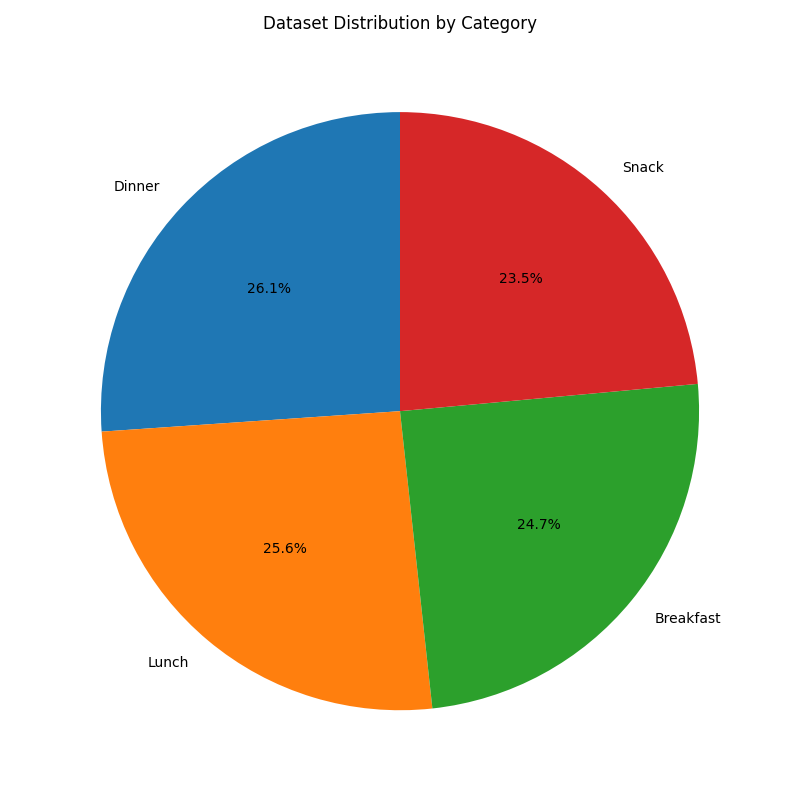
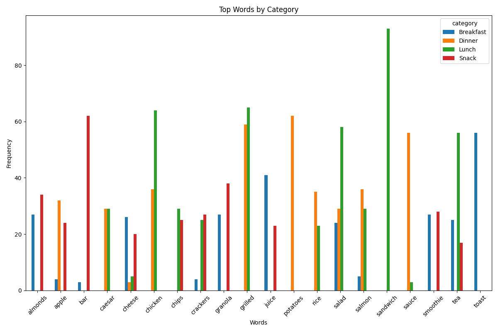
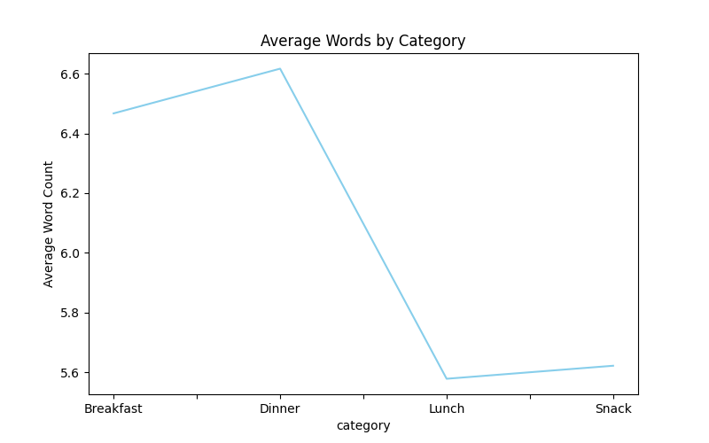
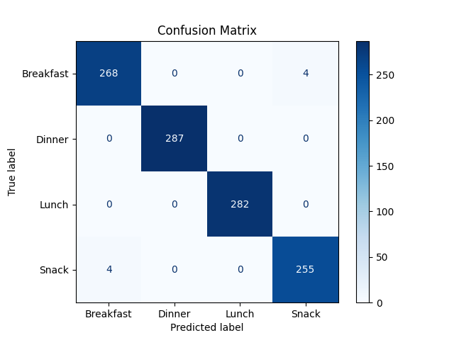
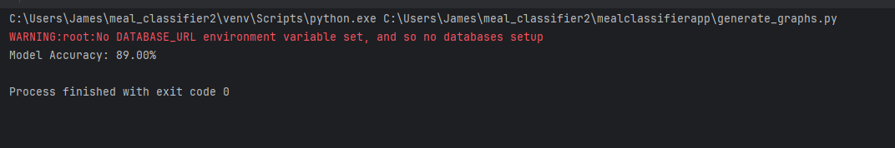

 Meal Classifier

## Overview
This project is built with Django, and is hosted by Heroku, and serves as a demonstration of a machine learning model that can process text input and return a classification. 
Below you will find the main application logic as well as the visuals that describe the test data.
 
---

## MAIN APPLICATION LOGIC

The main application logic involves training the model and vectorizing text data using the following key functions:

```python
def train_model():

    file_path = os.path.join(BASE_DIR, 'mealclassifierapp', 'data', 'meal_data.csv')
    data = pd.read_csv(file_path)
    descriptions = data['description']
    labels = data['category']


    vectorizer = CountVectorizer()
    X = vectorizer.fit_transform(descriptions)


    model = MultinomialNB()
    model.fit(X, labels)

    return model, vectorizer


model, vectorizer = train_model()
```

To review the full application logic, visit the [main logic file](mealclassifierapp/views.py)

---

## VISUALS

This section contains visual representations of the data that was used to train the machine learning model, as well as the confusion matrix for the model and the model's accuracy score.

### 1. Dataset Distribution Chart by Category


### 2. Word Usage Chart


### 3. Average Word Count by Category



### Confusion Matrix of the Model


### Accuracy Score of the Model



---

To review the logic that generated the visuals and accuracy score, visit the [generate graphs file](mealclassifierapp/generate_graphs.py)

---


